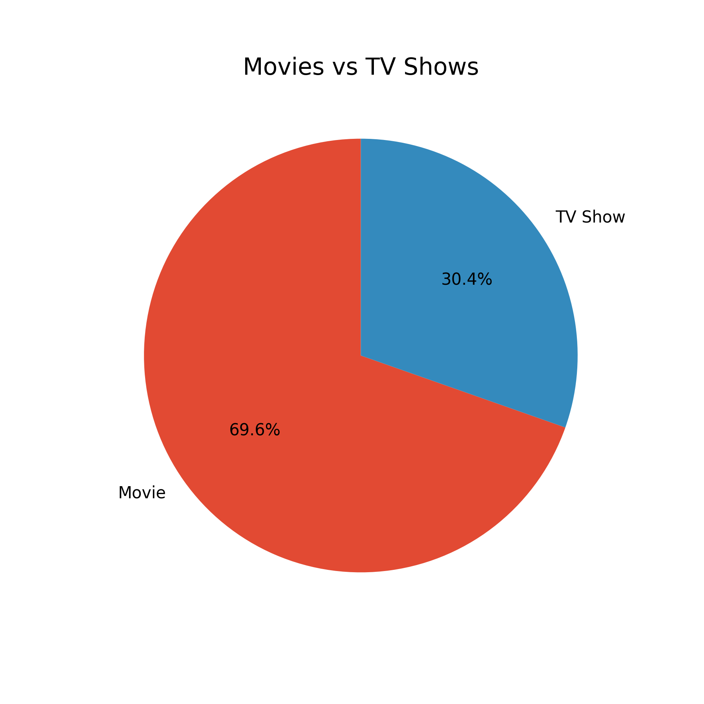
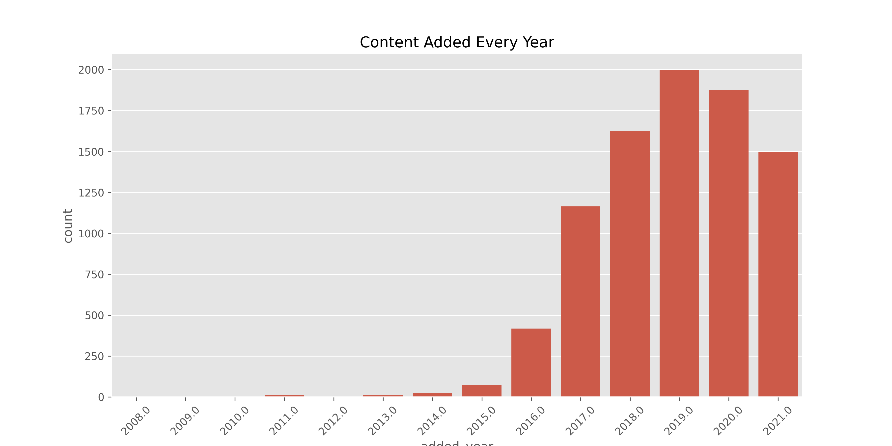
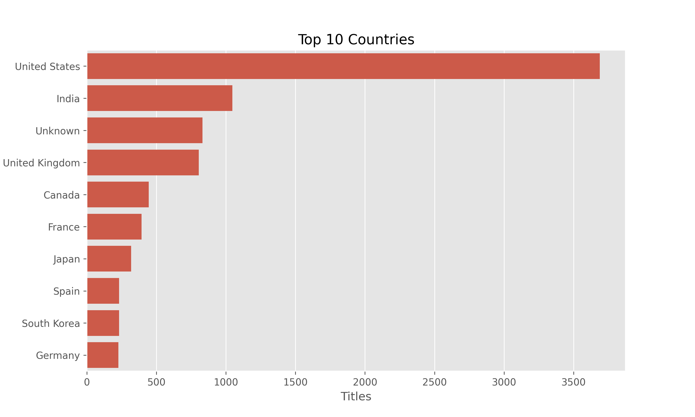
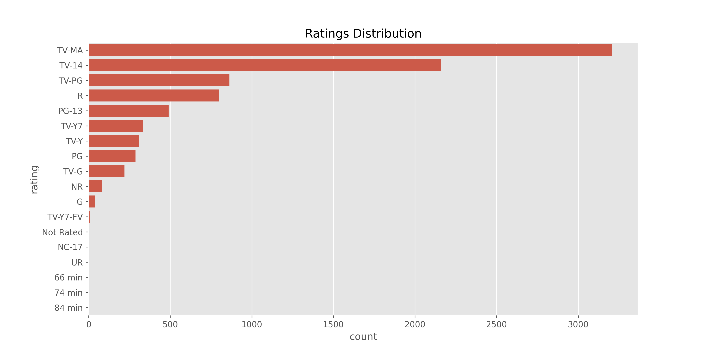
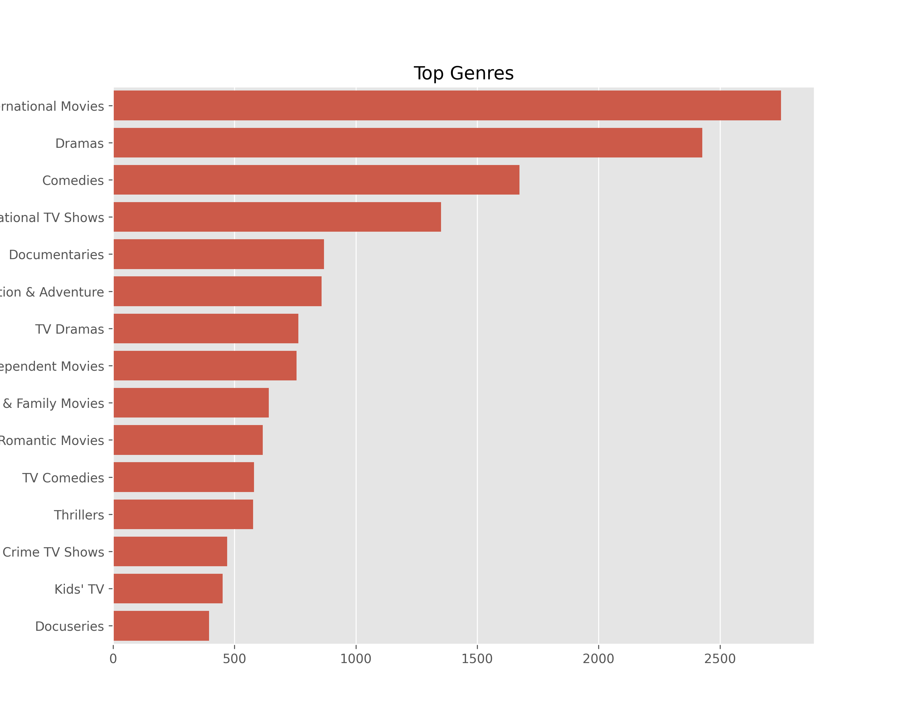
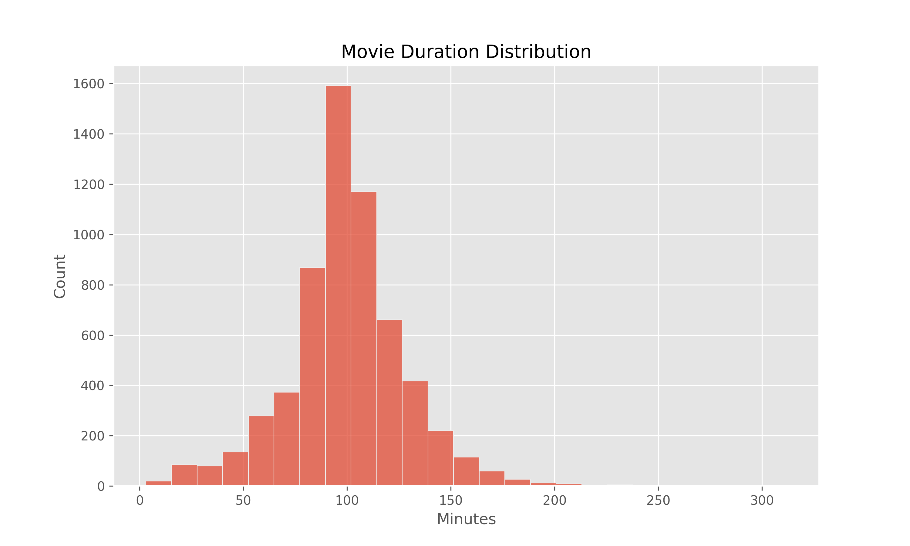
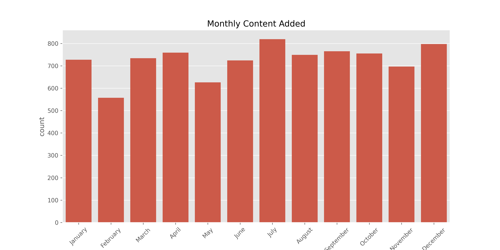
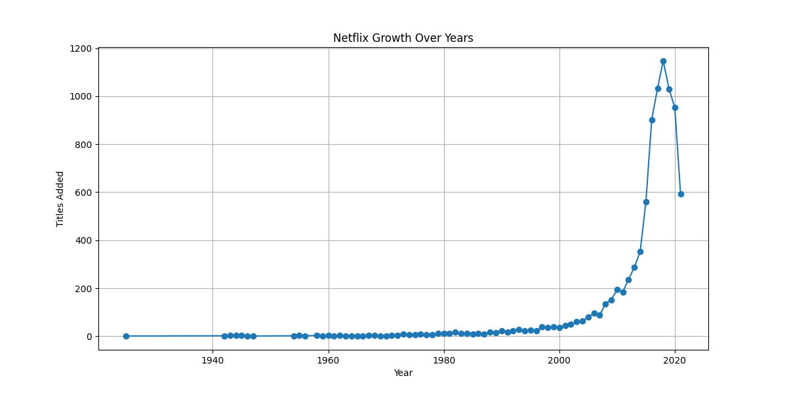
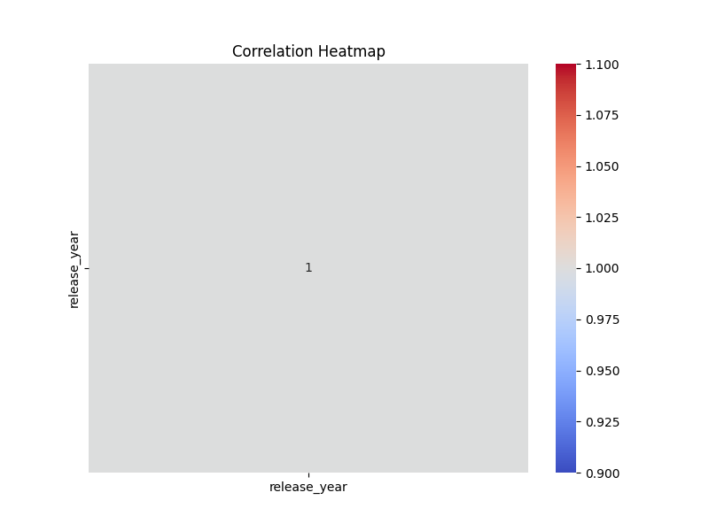

# 🎬 Netflix Data Analysis Project

An end-to-end data analytics project on the Netflix titles dataset — covering **data cleaning**, **exploratory data analysis (Python)**, **SQL business analysis**, and an interactive **Power BI dashboard**.



---

## 📌 Project Overview

This project explores Netflix's global content catalog (**8,807 titles**) to uncover trends in content type, geography, ratings, genres, and catalog growth over time — then translates those findings into business recommendations.

**Workflow:**

```
Raw Dataset (netflix_titles.csv)
        │
        ▼
 Data Cleaning & Feature Engineering  (data_analysis.ipynb)
        │
        ▼
 Exploratory Data Analysis            (eda.ipynb)
        │
        ▼
 SQL Business Queries                 (sql_data.sql)
        │
        ▼
 Business Reporting & Word Clouds     (business_report.ipynb)
        │
        ▼
 Interactive Dashboard                (netflix_dashboard.pbix)
```

---

## 🗂️ Repository Structure

| File | Description |
|---|---|
| `data_analysis.ipynb` | Data cleaning, missing value handling, type conversion, and feature engineering (extracts `added_year`, `added_month`, `duration_number`, etc.) |
| `eda.ipynb` | Exploratory data analysis with 10+ visualizations (distribution, trends, top countries/directors/genres) |
| `business_report.ipynb` | Word clouds, correlation heatmap, and growth-trend analysis for the business report |
| `netflix_report.md` | Summary of key findings and business recommendations |
| `sql_data.sql` | SQL schema + 16 business/analytical queries against the cleaned dataset |
| `sql_insight.md` | Written explanation of each SQL query and what it answers |
| `netflix_cleaned.csv` | Cleaned dataset (8,807 rows × 17 columns) used for EDA, SQL, and the dashboard |
| `netflix_dashboard.pbix` | Power BI dashboard for interactive exploration of the dataset |

---

## 🧹 1. Data Cleaning & Feature Engineering

Using `pandas`, the raw `netflix_titles.csv` (8,807 rows × 12 columns) was cleaned and enriched:

- Converted `date_added` to a proper datetime type
- Engineered new columns: `added_year`, `added_month`, `added_day`
- Split `duration` into `duration_number` (numeric) and `duration_unit` (min / season)
- Filled missing `director`, `cast`, `country`, and `rating` values
- Verified **zero duplicate rows**
- Exported the final cleaned dataset → `netflix_cleaned.csv` (8,807 rows × 17 columns)

---

## 📊 2. Exploratory Data Analysis

Key visualizations generated in `eda.ipynb`:

<table>
<tr>
<td></td>
<td></td>
</tr>
<tr>
<td align="center"><b>Content Added Per Year</b></td>
<td align="center"><b>Top 10 Content-Producing Countries</b></td>
</tr>
<tr>
<td></td>
<td></td>
</tr>
<tr>
<td align="center"><b>Ratings Distribution</b></td>
<td align="center"><b>Top Genres</b></td>
</tr>
<tr>
<td></td>
<td></td>
</tr>
<tr>
<td align="center"><b>Movie Duration Distribution</b></td>
<td align="center"><b>Monthly Content Additions</b></td>
</tr>
</table>

Additional charts (`04_top10_directors.png`, `06_release_year_distribution.png`, `09_tv_show_seasons.png`) are available in `/images`.

---

## 💼 3. Business Report

`business_report.ipynb` adds word clouds and correlation analysis on top of the EDA:

<table>
<tr>
<td></td>
<td></td>
</tr>
<tr>
<td align="center"><b>Genre Word Cloud</b></td>
<td align="center"><b>Netflix Catalog Growth Over Years</b></td>
</tr>
<tr>
<td></td>
<td></td>
</tr>
<tr>
<td align="center"><b>Correlation Heatmap</b></td>
<td align="center"><b>Movies vs TV Shows Added Yearly</b></td>
</tr>
</table>

### 🔑 Key Findings

- Movies represent ~70% of the catalog
- Netflix experienced rapid content growth after 2015
- The United States contributes the largest share of titles
- **TV-MA** is the dominant content rating
- International content has increased significantly over time
- Drama and International Movies are among the most common genres

### 💡 Business Recommendations

- Increase investment in international content
- Expand production in high-performing countries
- Focus marketing around popular genres
- Continue balancing movie and TV show releases
- Leverage audience ratings to guide future acquisitions

*(Full report: [`netflix_report.md`](netflix_report.md))*

---

## 🗃️ 4. SQL Analysis

A relational schema (`netflix_titles`) was built in MySQL and queried to answer 16 business questions, including:

- Total titles, and Movies vs TV Shows split
- Top 10 countries and top 10 directors by title count
- Content added per year (growth analysis)
- Average movie duration & longest movies/TV shows
- Oldest and most recent titles
- Movies released since 2018, and movies longer than 120 minutes
- Rating distribution for Movies vs TV Shows
- Percentage of catalog that is TV Shows (subquery)
- Most popular release years

Concepts demonstrated: `GROUP BY`, `ORDER BY`, `WHERE` filtering, aggregate functions (`COUNT`, `AVG`), subqueries, and percentage calculations.

📄 Full query set: [`sql_data.sql`](sql_data.sql) · Explanation of each query: [`sql_insight.md`](sql_insight.md)

---

## 📈 5. Power BI Dashboard

`netflix_dashboard.pbix` brings the cleaned dataset into an interactive dashboard for filtering and drilling down by content type, country, genre, rating, and year — built on top of `netflix_cleaned.csv`.

> Open `netflix_dashboard.pbix` in Power BI Desktop to explore the dashboard interactively.

---

## 🛠️ Tech Stack

- **Python**: pandas, numpy, matplotlib, seaborn, wordcloud
- **SQL**: MySQL
- **BI Tool**: Power BI
- **Environment**: Jupyter Notebook

---

## 🚀 How to Run

```bash
# 1. Clone the repo
git clone <your-repo-url>
cd netflix-data-analysis

# 2. Install dependencies
pip install pandas numpy matplotlib seaborn wordcloud

# 3. Run the notebooks in order
jupyter notebook data_analysis.ipynb   # cleaning
jupyter notebook eda.ipynb             # exploratory analysis
jupyter notebook business_report.ipynb # business report & word clouds

# 4. Run SQL analysis
mysql -u <user> -p < sql_data.sql

# 5. Open the dashboard
# Open netflix_dashboard.pbix in Power BI Desktop
```

---

## 📬 Contact

If you have questions or suggestions about this project, feel free to open an issue or reach out.
